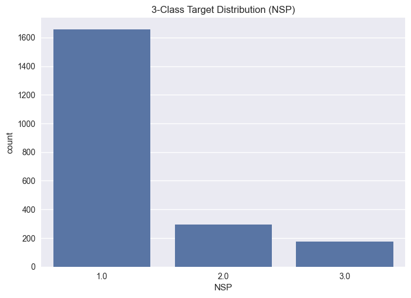
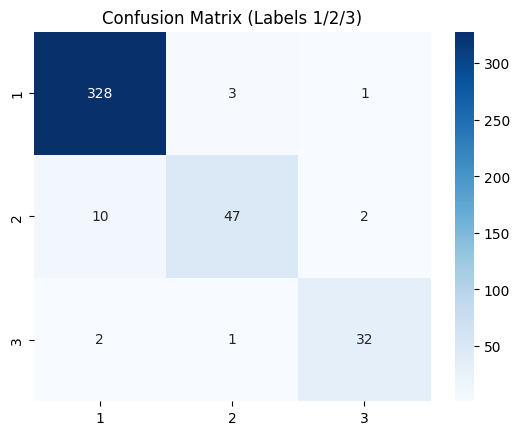
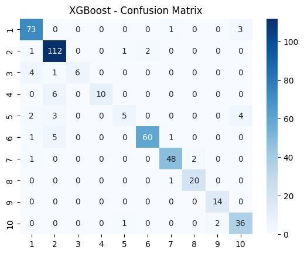

# **Multiclass Classification on the Cardiotocography (CTG) Dataset**

Cardiotocography is a routine tool for fetal monitoring, but its interpretation is **highly subjective and error-prone**, with significant consequences if fetal distress is missed. 

A reliable ML-based classifier can help **standardize CTG interpretation**, support obstetricians in early risk detection, and reduce preventable complications—especially in high-workload or resource-limited clinical settings. This project builds two end-to-end machine-learning pipelines for fetal health assessment using the UCI Cardiotocography (CTG) dataset. It explores both official label schemes:

* **NSP (3-Class):** Normal / Suspect / Pathologic
* **CLASS (10-Class):** Detailed FHR morphological pattern codes (1–10)

Beyond standard classification, the project implements a clinically aligned decision layer to introduce medical risk sensitivity, ensuring safer predictions when dealing with potential fetal distress.

# ⭐ **Results Summary**

| Problem                             | Model    | Accuracy  | Macro-F1  |
| ----------------------------------- | -------- | --------- | --------- |
| NSP (3-Class)                       | XGBoost  | **0.955** | **0.915** |
| CLASS (10-Class)                    | LightGBM | **0.915** | **0.871** |
| NSP + Cost-Sensitive Decision Layer | XGBoost  | **0.950** | **0.909** |
| NSP + Clinical Triage System        | XGBoost  | **0.953** | **0.911** |

The NSP classifier achieves **high stability on the Suspect and Pathologic classes**, which are the most clinically critical categories.

# **Dataset Citation**

> UCI Machine Learning Repository — *Cardiotocography*
> [https://archive.ics.uci.edu/dataset/193/cardiotocography](https://archive.ics.uci.edu/dataset/193/cardiotocography)

# **Dataset Overview**

The CTG dataset contains:

* **2126** fetal cardiotocograms
* **21 diagnostic features** (FHR metrics, uterine contractions, variability indices)
* Two complementary target labels:

  * **NSP (3-class):** Clinical fetal state (Normal, Suspect, Pathologic)
  * **CLASS (10-class):** More granular FHR morphological pattern codes

Both labels are **highly imbalanced**, especially the Pathologic (NSP) and upper-code (CLASS) categories, making evaluation with **macro-F1** essential.

### NSP Label Distribution



### CLASS Label Distribution


# **PART I — NSP (3-Class) Classification**

A full model sweep was performed across linear, tree-based, and neural models to establish a strong baseline.

### **Baseline Comparison**

XGBoost dominated all baselines, achieving the strongest accuracy and macro-F1 while maintaining stability on **Suspect**—the hardest and most clinically relevant class.

| Model               | Accuracy  | Macro-F1  |
| ------------------- | --------- | --------- |
| XGBoost             | **0.953** | **0.913** |
| LightGBM            | 0.948     | 0.898     |
| CatBoost            | 0.934     | 0.879     |
| Random Forest       | 0.930     | 0.859     |
| Extra Trees         | 0.925     | 0.841     |
| Linear SVM          | 0.892     | 0.792     |
| kNN                 | 0.883     | 0.757     |
| Logistic Regression | 0.871     | 0.756     |
| MLP                 | 0.854     | 0.727     |
| Naive Bayes         | 0.815     | 0.674     |

### **Hyperparameter Optimization (Optuna)**

Fine-tuning XGBoost offered a marginal improvement:

| Model           | Accuracy  | Precision | Recall    | Macro-F1 |
| --------------- | --------- | --------- | --------- | ---------|
| XGBoost (tuned) | **0.955** | **0.930** | **0.900** | **0.915**|

This indicates that XGBoost already operates near the dataset’s performance ceiling.

### Confusion Matrix



# **PART II — Clinically Informed NSP Classification**

Standard ML classifiers treat all errors equally—**but clinical risk is asymmetric**.
Missing a *Pathologic* fetus is drastically worse than misclassifying a normal case as suspect.

To reflect this, two post-processing systems were built on top of the model’s probability outputs.

## **1. Cost-Sensitive Decision Layer (Expected Risk Minimization)**

A clinically motivated **cost matrix** was defined:

```python
# True class = row, Predicted class = column
C = np.array([
    [0, 1, 4],   # Normal → Pathologic: false alarm, but tolerable
    [2, 0, 3],   # Suspect → Normal: missed early warning
    [6, 3, 0],   # Pathologic → Normal: catastrophic miss
])
```

Prediction becomes:

> **predict = argmin (C.T × probability_vector)**

### Performance

* **Accuracy:** 0.950
* **Macro-F1:** 0.909

Tradeoff:
Slightly lower metrics but **significantly safer behavior** on borderline cases.

## **2. Clinical Triage System (Threshold Escalation)**

A simpler rule-based system:

```python
if P(Pathologic) ≥ 0.30: predict Pathologic
elif P(Suspect) ≥ 0.45: predict Suspect
else: predict Normal
```

### Performance

* **Accuracy:** **0.953** (very close to baseline)
* **Macro-F1:** 0.911

Key outcomes:

* **Borderline samples escalate upward** (Normal → Suspect, etc.)
* Achieves **nearly dentical accuracy and Macro-F1** while being clinically conservative

### Why This Matters

These systems demonstrate how ML models can be **adapted to medical risk**, not just statistical metrics—an important consideration for real diagnostic support.

# **PART III — CLASS (10-Class) Classification**

The CLASS task is substantially harder due to:

* **More classes (1–10)**
* **Severe imbalance**
* **Subtle FHR pattern differences**

### Baseline Results

| Model               | Accuracy  | Macro-F1  |
| ------------------- | --------- | --------- |
| LightGBM            | **0.904** | **0.863** |
| XGBoost             | 0.901     | 0.840     |
| CatBoost            | 0.894     | 0.835     |
| Random Forest       | 0.897     | 0.830     |
| Extra Trees         | 0.880     | 0.801     |
| Linear SVM          | 0.843     | 0.755     |
| Logistic Regression | 0.808     | 0.719     |
| MLP                 | 0.812     | 0.685     |
| kNN                 | 0.707     | 0.597     |
| Naive Bayes         | 0.615     | 0.585     |

### Hyperparameter Optimization

| Model            | Accuracy  | Precision | Recall    | Macro-F1  |
| ---------------- | --------- | --------- | --------- | --------- |
| LightGBM (tuned) | **0.915** | **0.910** | **0.850** | **0.871** |

### Confusion Matrix



# **How to Use This Repository**

### 1. Install dependencies

```bash
pip install -r requirements.txt
```

### 2. NSP Pipeline

Run notebooks in order:

```
01_EDA.ipynb  
02_NSP_Baseline.ipynb  
03_NSP_Complex.ipynb  
06_NSP_Decision_Layer.ipynb
```

### 3. CLASS Pipeline

Run:

```
01_EDA.ipynb  
04_CLASS_Baseline.ipynb  
05_CLASS_Complex.ipynb
```
